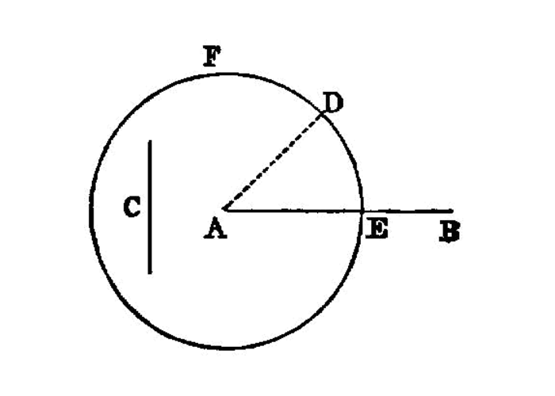

.. index:: construction, lines

.. _I.3:
.. _construct equal segments by section:

construct equal segments by section
===================================

  I.3

  Given two unequal straight lines, to cut off from the greater a straight line
  equal to the less.

  -- Euclid

Let **AB**, **C** be the two given unequal straight lines, and let **AB** be
the greater of them.

Thus it is required to cut off from **AB** the greater a straight line equal to
**C** the less.

At the point **A** let **AD** be placed equal to the straight line **C**; [I.2]
and with centre **A** and distance **AD** let the circle **DEF** be described.
[I.post.3] 

Now, since the point **A** is the centre of the circle **DEF**, **AE** is equal
to **AD**. [I.def.15] But **C** is also equal to **AD**.  

:math:`\therefore` each of the straight lines **AE**, **C** is equal to **AD**; so that **AE** is also
equal to **C**. [I.c.n.1]

:math:`\therefore`, given the two straight lines **AB**, **C**, from **AB** the greater
**AE** has been cut off equal to **C** the less.

- (Being) what it was required to do.

dependencies
------------

[I.def.15]: /elem.1.def.15 "Book I - Definition 15"
[I.2]: /elem.1.2 "Book I - Proposition 2"
[I.post.3]: /elem.1.post.3 "Book I - Postulate 3"
[I.c.n.1]: /elem.1.c.n.1 "Book I - Common Notion 1"

