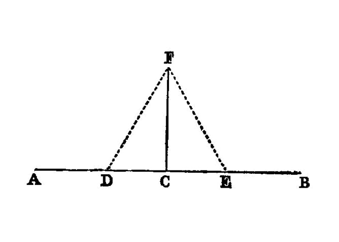

.. index:: construction, perpendicular

.. _I.11:
.. _construct perpendicular from point on line:

construct perpendicular from point on line
==========================================

  I.11

  To draw a straight line at right angles to a given straight line from a given point on it.

  -- Euclid

Let `AB` be the given straight line, and `C` the given point on it. 

**PROBLEM:** draw from the point `C` a straight line at right angles to the straight line `AB`.

Let a point `D` be taken at random on `AC`; [1]_ let `CE` be made equal to `CD`; [I.3] on `DE` let the equilateral triangle `FDE` be constructed, [I.1] and let `FC` be joined; 

I say that the straight line `FC` has been drawn at right angles to the given straight line `AB` from `C` the given point on it.

For, since `DC` is equal to `CE`, and `CF` is common, 

- the two sides `DC`, `CF` are equal to the two sides `EC`, `CF` respectively;

and the base `DF` is equal to the base `FE`; 

- therefore the angle `DCF` is equal to the angle `ECF`; [I.8]

 and they are adjacent angles.

But, when a straight line set up on a straight line makes the adjacent angles equal to one another, each of the equal angles is right; [I.def.10] 

- therefore each of the angles `DCF`, `FCE` is right.

Therefore the straight line `CF` has been drawn at right angles to the given straight line `AB` from the given point `C` on it.

- Q. E. F.

references
----------

[I.def.10]: /elem.1.def.10 "Book I - Definition 10"
[I.1]: /elem.1.1 "Book I - Proposition 1"
[I.3]: /elem.1.3 "Book I - Proposition 3"
[I.8]: /elem.1.8 "Book I - Proposition 8"

footnotes 
----------

.. [1] let CE be made equal to CD.
    The verb is <foreign lang="greek">κείσθω</foreign> which, as well as the other parts of <foreign lang="greek">κεῖμαι</foreign>, is constantly used for the passive of <foreign lang="greek">τίθημι</foreign> <quote>to <em>place</em></quote> ; and the latter word is constantly used in the sense of <em>making</em>, e.g., one straight line equal to another straight line.
